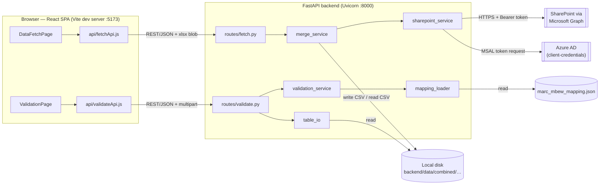
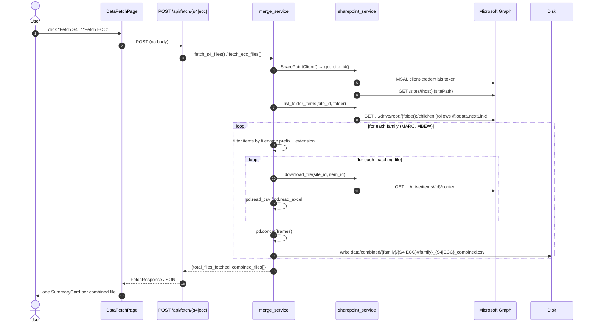
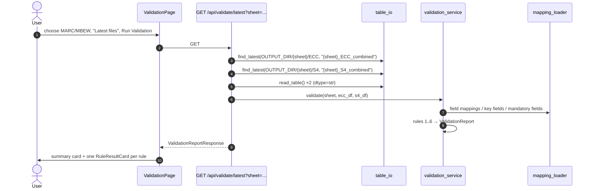

# 01 — Overview and Architecture

> Part of the [documentation set](README.md). Written against commit `731e6cd`
> ("Changes to sharepoint with validation portion").

## 1. What this project is

The **GyanSys Migration Tool** (the UI header calls it "Sharepoint Automation
Tool"; the repo is `Sharepoint-RO-Automation`) is a small full-stack web app that
supports an **SAP ECC → SAP S/4HANA data-migration workflow**. It automates two
manual chores that a migration team otherwise does by hand:

1. **Data Fetch** — Pull the raw extract files for two SAP master-data tables
   from a SharePoint document library through Microsoft Graph, merge the many
   part-files of each extract into one combined CSV, and let the user preview
   and download the result.
2. **Validation** — Prove the ECC extract was converted correctly into the S/4
   target file by running six rule checks derived from a field-mapping workbook.

The code comments describe the intended pipeline as
**Fetch → Process → Validate → Push**. Only *Fetch* and *Validate* exist today;
*Process* and *Push* are not implemented.

### Domain glossary

| Term | Meaning in this codebase |
|---|---|
| **ECC** | The legacy SAP ERP Central Component system — the *source* of the migration. |
| **S/4** (`S4`) | SAP S/4HANA — the *target*. In this repo S4 files are the ones exported from Databricks. |
| **MARC** | SAP table *Plant Data for Material*. One row per material × plant. Called the "MARC sheet" or "Plant Data". |
| **MBEW** | SAP table *Material Valuation*. One row per material × valuation area (× valuation type). Called the "MBEW sheet" or "Valuation Data". |
| **Family** | The table group being processed: `MARC` or `MBEW`. |
| **Source type** | Which side a file belongs to: `ECC` or `S4`. |
| **DAP** | Suffix of the ECC extract filenames (`MARC_DAP…xlsx`, `MBEW_DAP…xlsx`). |
| **`S_MARC#FreeText` / `S_MBEW#FreeText`** | Filename prefixes of the S/4 (Databricks) CSV extracts. |
| **Combined file** | The single CSV produced by concatenating all part-files of one family/source type. |
| **Mapping** | `MARC_MBEW_Mappings.xlsx` (pre-parsed to JSON) — defines which ECC field feeds which S/4 field, its type/length, and whether it is mandatory. |
| **Databricks** | The platform that produces the S/4-side extracts; the SharePoint folder holding them is named `Databricks Files`. |
| **Graph** | Microsoft Graph REST API, used to read SharePoint. |

## 2. Technology stack

| Layer | Technology | Version (pinned) | Where |
|---|---|---|---|
| API framework | FastAPI | 0.115.0 | `backend/requirements.txt` |
| ASGI server | Uvicorn (`[standard]`) | 0.30.6 | |
| Data handling | pandas | 2.2.2 | |
| Microsoft auth | MSAL for Python | 1.31.0 | |
| HTTP client | requests | 2.32.3 | |
| Config | python-dotenv | 1.0.1 | |
| Uploads | python-multipart | 0.0.9 | needed by FastAPI for `UploadFile` |
| **Excel engine** | **openpyxl** | **not pinned — see [known issue #1](08-known-issues.md#1-openpyxl-is-missing-from-requirementstxt)** | used implicitly by pandas |
| UI framework | React | ^18.3.1 | `frontend/package.json` |
| Routing | react-router-dom | ^6.26.2 | |
| Build tool | Vite (+ `@vitejs/plugin-react`) | ^5.4.8 / ^4.3.1 | |
| Styling | Tailwind CSS 3 + PostCSS + Autoprefixer | ^3.4.13 | |

The zipped snapshot in the repo contains `cpython-311` bytecode, so the
original developer ran **Python 3.11**. That is the safest interpreter choice:
pandas 2.2.2 has no wheels for Python 3.13+.

There is **no database**, **no authentication on the API**, **no task queue**,
and **no automated tests**. State lives entirely on the local filesystem
(`backend/data/combined/…`).

## 3. Repository layout

```
Sharepoint-RO-Automation/
├── README.md                     Original readme (partly stale — see known issues)
├── .gitignore
├── docs/                         ← this documentation
│
├── backend/
│   ├── requirements.txt
│   ├── .env.example              Template for backend/.env (secrets go in .env, never committed)
│   ├── backend_Zip.zip           Stale snapshot of the backend (see §7)
│   ├── app/
│   │   ├── main.py               FastAPI app, CORS, router registration, /api/health
│   │   ├── core/config.py        Settings object read from environment variables
│   │   ├── models/schemas.py     Pydantic request/response models
│   │   ├── api/routes/
│   │   │   ├── fetch.py          /api/fetch/*, /api/preview/*, /api/download/*
│   │   │   └── validate.py       /api/validate/*
│   │   ├── services/
│   │   │   ├── sharepoint_service.py   Graph client: token, site id, list, download
│   │   │   ├── merge_service.py        Fetch + combine + preview + xlsx export
│   │   │   ├── table_io.py             read_table(), find_latest()
│   │   │   ├── mapping_loader.py       Mapping JSON → typed lookups
│   │   │   └── validation_service.py   The six validation rules
│   │   └── data/
│   │       ├── MARC_MBEW_Mappings.xlsx Source of truth for the mapping
│   │       └── marc_mbew_mapping.json  Pre-parsed mapping used at runtime
│   └── data/combined/            Generated output (CSV) — committed by accident, see known issues
│       ├── MARC/{ECC,S4}/MARC_{ECC,S4}_combined.csv
│       └── MBEW/{ECC,S4}/MBEW_{ECC,S4}_combined.csv
│
└── frontend/
    ├── package.json, vite.config.js, tailwind.config.js, postcss.config.js, index.html
    ├── frontend_zip.zip          Stale snapshot of frontend/src
    └── src/
        ├── main.jsx              React entry (StrictMode)
        ├── App.jsx               Router + page chrome
        ├── index.css             Tailwind directives
        ├── api/                  fetchApi.js, validateApi.js (HTTP client functions)
        ├── pages/                DataFetchPage.jsx, ValidationPage.jsx
        ├── components/
        │   ├── layout/           Header, NavBar, Footer
        │   ├── data-fetch/       FetchActionCard, StatusPanel, SummaryCard, PreviewTable
        │   └── validation/       ValidationActionCard, ValidationStatusPanel,
        │                         ValidationSummaryCard, RuleResultCard, RuleDetailValue
        └── assets/gyansys-logo.png
```

## 4. Architecture

### 4.1 Component view



### 4.2 Layering rules the code follows

The backend follows a deliberate three-layer split (stated in the original
README) and the code mostly honours it:

| Layer | Modules | Responsibility | Rule |
|---|---|---|---|
| **API / routes** | `api/routes/*.py` | Parse HTTP input, call one service function, translate exceptions into `HTTPException`, shape the response with a Pydantic model. | No business logic. *(Exception: `validate.py` contains the upload-reading helper and directory path building — see [03-backend](03-backend.md#validate-routes).)* |
| **Services** | `services/*.py` | All business logic, I/O with SharePoint and disk, the validation rules. | Framework-agnostic — no FastAPI imports. |
| **Models / config** | `models/schemas.py`, `core/config.py` | API contracts and settings. | Pure data. |

### 4.3 Data flow — Fetch



### 4.4 Data flow — Validation ("latest files" mode)



The **upload** mode (`POST /api/validate/upload`) is identical from
`validate()` onward; it just reads the two DataFrames from the multipart upload
instead of from disk.

## 5. Key design decisions (and their consequences)

| Decision | Rationale (from the code/comments) | Consequence |
|---|---|---|
| **CSV as the storage format**, XLSX only on demand | CSV is fast to write and to re-read for previews. `build_xlsx_bytes` converts in memory per download and never caches. | Fetches stay cheap; every download re-reads the whole CSV and rebuilds the workbook. |
| **Filesystem as the only persistence** | Simplicity. | State is per-machine; concurrent fetches overwrite the same file; there is no history/versioning despite the "latest file" wording. |
| **Validation rules are derived from the mapping, not hard-coded** | A change to the Excel workbook changes what is checked. | The mapping's **column names must match the data files' headers** — the single biggest risk today (see [known issue #2](08-known-issues.md#2-validation-cannot-match-the-committed-data-header-and-value-mismatch)). |
| **Families are a dict**, not code | Adding MLAN etc. should be one line. | True for fetching (`S4_GROUPS`/`ECC_GROUPS`), but validation additionally needs a mapping sheet and `_SECONDARY_KEY_FIELD` entry. |
| **Server-side "latest file" discovery** by `mtime` | UI needs no file picker. | Because the fetch always writes the same filename, "latest" is just "the one file". |
| **Errors surfaced verbatim to the UI** (`detail=str(exc)`) | Fast debugging for a small internal team. | Internal exception text (including Graph/HTTP errors) reaches the browser. |

## 6. Runtime characteristics

* **Synchronous, blocking endpoints.** All routes are plain `def`, so FastAPI
  runs them in its thread pool. A fetch downloads every file sequentially with
  no timeout and no progress reporting; the browser request stays open until it
  completes (the UI shows "Fetching files and combining them…").
* **Memory.** Each fetch holds every part-file DataFrame in memory before
  concatenating. The committed MARC-ECC combined file is ≈ 11.8 MB
  (29 387 rows × 249 columns); converting it to XLSX in memory is
  substantially heavier than the CSV.
* **Token lifetime.** A `SharePointClient` is created per request and caches its
  Graph token only for that instance, so each fetch performs a fresh token
  request. (`sharepoint_service`'s docstring says "for the life of the request".)
* **CORS.** Exactly one origin is allowed (`FRONTEND_ORIGIN`, default
  `http://localhost:5173`), with credentials, all methods and all headers.

## 7. Committed artefacts you should know about

| File | What it is | Notes |
|---|---|---|
| `backend/backend_Zip.zip` (1.9 MB) | An **older** snapshot of `backend/` including `__pycache__` and the four combined CSVs. | Smaller `merge_service.py`/`fetch.py`/`config.py` than the live tree — it is a previous revision, not a build artefact. Safe to ignore; consider deleting. |
| `frontend/frontend_zip.zip` (41 KB) | Older snapshot of `frontend/src`. | Same. |
| `backend/data/combined/**/*.csv` (~28 MB) | Real generated combined extracts (~29 k MARC-ECC rows, etc.). | `.gitignore` has `backend/data/combined/*.csv`, which only matches the top-level folder, so the nested CSVs are **tracked**. They may contain business data — review before sharing the repo. |
| `backend/app/data/*` | The mapping workbook and its JSON. | Intentionally committed; the JSON is what runs. |
