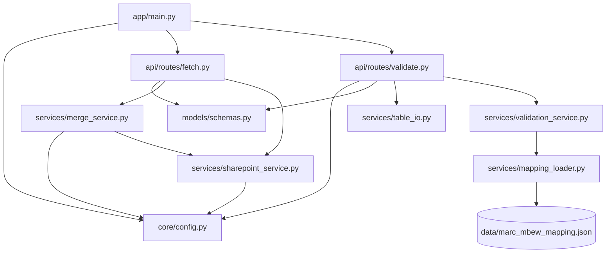

# 03 — Backend Reference

> **Historical (pre-agentic).** This page describes the codebase at commit `731e6cd`. The fetch/merge services, the JSON mapping and several routes described here have been replaced - see [09 — Agentic architecture](09-agentic-architecture.md) for the current structure.

> Part of the [documentation set](README.md). Every function in `backend/app/`
> is covered here. Line numbers refer to commit `731e6cd`.

## Module dependency graph



There are no circular imports. `validation_service` and `mapping_loader` do
not touch the network or FastAPI, so they are unit-testable in isolation
(there are no tests yet).

---

## `app/main.py` — application entry point

```python
app = FastAPI(title="GyanSys Migration Tool API", version="0.1.0")
```

* Adds `CORSMiddleware` with `allow_origins=[settings.FRONTEND_ORIGIN]`,
  `allow_credentials=True`, `allow_methods=["*"]`, `allow_headers=["*"]`.
* Registers `fetch_routes.router` and `validate_routes.router`.
* Defines `GET /api/health` → `{"status": "ok"}` (pure liveness — it does **not**
  test SharePoint or the filesystem).

Run with `uvicorn app.main:app --reload --port 8000` from `backend/`.

---

## `app/core/config.py` — settings

A plain class `Settings` whose attributes are read once at import time
(`os.getenv`) after `load_dotenv()`; the module exposes a singleton
`settings = Settings()`. There is no validation — a missing secret becomes the
empty string and only fails later, at token acquisition.

See the full variable table in
[02-setup-and-operations §3](02-setup-and-operations.md#3-configuration-reference-backendenv).

Because values are class attributes evaluated at import, changing the
environment while the process runs has no effect.

---

## `app/models/schemas.py` — Pydantic models

| Model | Fields | Used by |
|---|---|---|
| `CombinedFileStat` | `name: str` (e.g. `"MARC_S4"`), `family: str`, `source_type: str`, `source_files: int`, `row_count: int`, `saved_path: str` | element of `FetchResponse.combined_files` |
| `FetchResponse` | `total_files_fetched: int`, `combined_files: List[CombinedFileStat]`, `message: str` | `POST /api/fetch/s4`, `/ecc` |
| `ErrorResponse` | `detail: str` | **defined but never used** (FastAPI's default error body is `{"detail": …}` anyway) |
| `PreviewResponse` | `name: str`, `columns: List[str]`, `rows: List[dict]`, `total_rows: int`, `preview_row_count: int` | `GET /api/preview/…` |
| `RuleStatusLiteral` | `Literal["pass","fail","warning"]` | type alias |
| `RuleResultResponse` | `rule_id: str`, `name: str`, `status`, `summary: str`, `details: List[Any] = []` | element of the report |
| `ValidationReportResponse` | `sheet`, `key_fields: List[str]`, `ecc_row_count`, `s4_row_count`, `ecc_source`, `s4_source`, `overall_status`, `rules: List[RuleResultResponse]` | both `/api/validate/*` endpoints |

`details` is intentionally `List[Any]` because each rule emits a different shape
(see [05-validation-engine](05-validation-engine.md)). Note that `combined_files`
dictionaries returned by services are coerced into `CombinedFileStat` by Pydantic.

---

## `app/services/sharepoint_service.py` — Microsoft Graph client

Constants: `GRAPH_BASE = "https://graph.microsoft.com/v1.0"`.

### `class SharePointAuthError(RuntimeError)`
Raised when MSAL returns no `access_token`. Message format:
`Failed to acquire token: {error} - {error_description}`.
**The route layer imports this class but never catches it specifically**, so it
becomes a generic 502.

### `class SharePointClient`

| Member | Behaviour |
|---|---|
| `__init__()` | Sets `self._token = None`. |
| `_get_token() -> str` | Returns the cached token if present; otherwise builds `msal.ConfidentialClientApplication(client_id, client_credential=secret, authority=https://login.microsoftonline.com/{tenant})` and calls `acquire_token_for_client(scopes=["https://graph.microsoft.com/.default"])`. Raises `SharePointAuthError` if the result lacks `access_token`. Stores and returns the token. **No expiry tracking** — a client instance is short-lived (one per fetch request), so this is fine today. |
| `_headers() -> dict` | `{"Authorization": "Bearer <token>"}`. |
| `get_site_id() -> str` | `GET {GRAPH_BASE}/sites/{SHAREPOINT_HOSTNAME}:{SITE_PATH}`; `raise_for_status()`; returns `resp.json()["id"]` (the composite `host,siteGuid,webGuid` id). |
| `list_folder_items(site_id, folder_path) -> list[dict]` | If `folder_path` is non-empty: `GET …/sites/{id}/drive/root:/{folder_path}:/children`. If empty: `GET …/sites/{id}/drive/root/children`. Follows `@odata.nextLink` until exhausted, accumulating `value`. Returns **all** children — files *and* folders; callers filter by name. |
| `download_file(site_id, item_id) -> bytes` | `GET …/sites/{id}/drive/items/{item_id}/content`; returns `resp.content` (entire file in memory). |

Notes:

* Every `requests.get` is made **without a `timeout`**, so a stalled connection
  blocks the worker thread indefinitely.
* Errors from Graph propagate as `requests.HTTPError` (message contains status
  and URL) — the route layer turns them into 502 responses.
* There is a commented-out earlier version of `list_folder_items` (lines 70–82)
  that did not support the library root.

---

## `app/services/merge_service.py` — fetch, combine, preview, export

The top ~135 lines are a **commented-out earlier version** (single
`/api/fetch`, `GROUPS` dict, `<name>_combined.csv` files). The live code starts at
line 136.

### Constants

```python
S4_GROUPS  = {"MARC": "S_MARC#FreeText", "MBEW": "S_MBEW#FreeText"}   # family -> filename prefix
ECC_GROUPS = {"MARC": "MARC_DAP",        "MBEW": "MBEW_DAP"}
OUTPUT_EXT = ".csv"
```

### `class CombinedFileNotFound(FileNotFoundError)`
Signals "unknown family/source type" or "file not generated yet". Routes map it
to HTTP 404.

### Helpers

* `_get_output_dir(family, source_type) -> str` →
  `os.path.join(settings.OUTPUT_DIR, family, source_type)`.
* `_matches(filename, prefix, extensions) -> bool` →
  `filename.startswith(prefix) and filename.lower().endswith(extensions)`.
  The prefix test is **case-sensitive**; the extension test is not.

### `fetch_s4_files() -> dict`

1. `client = SharePointClient(); site_id = client.get_site_id()`.
2. `items = client.list_folder_items(site_id, settings.FOLDER_PATH)` (default
   `"Databricks Files"`).
3. For each `(family, prefix)` in `S4_GROUPS`:
   * `matching` = items whose name starts with the prefix and ends with `.csv`.
   * For each match: download and `pd.read_csv(BytesIO(content), low_memory=False)`;
     `total_fetched += 1`. **No `dtype` is forced**, so pandas infers types (leading
     zeros in an all-numeric column would be lost; numeric-with-blank columns
     become floats such as `1.0`).
   * `combined_df = pd.concat(frames, ignore_index=True)` (or an empty
     `DataFrame` if nothing matched).
   * Write to `OUTPUT_DIR/{family}/S4/{family}_S4_combined.csv` (`index=False`),
     creating the directory as needed.
   * Append a stat dict: `name="{family}_S4"`, `family`, `source_type="S4"`,
     `source_files=len(matching)`, `row_count`, `saved_path=os.path.abspath(...)`.
4. Return `{"total_files_fetched": total_fetched, "combined_files": [...]}`.

### `fetch_ecc_files() -> dict`

Identical structure, with these differences:

| | S4 | ECC |
|---|---|---|
| Folder | `settings.FOLDER_PATH` | `settings.ECC_FOLDER_PATH` (empty = library root) |
| Prefixes | `S_MARC#FreeText`, `S_MBEW#FreeText` | `MARC_DAP`, `MBEW_DAP` |
| Extensions | `.csv` | `.xlsx`, `.xls` |
| Reader | `pd.read_csv(..., low_memory=False)` | `pd.read_excel(..., engine="openpyxl")` (first sheet only, header row 0, no `dtype`) |
| Output | `…/{family}/S4/{family}_S4_combined.csv` | `…/{family}/ECC/{family}_ECC_combined.csv` |

Behaviour to be aware of (all confirmed by reading the code):

* **Nothing matches ⇒ an empty CSV is still written**, replacing any previous good
  file (an empty DataFrame serialises to a bare newline). The response reports
  `source_files: 0, row_count: 0` and HTTP 200.
* `.xls` passes the filename filter, but the reader is forced to
  `engine="openpyxl"`, which cannot open legacy `.xls` files — an `.xls` match
  would raise and the whole fetch would fail with a 502. Only `.xlsx` actually works.
* Parts with different column sets are unioned by `pd.concat` (missing cells become
  NaN); duplicate column names within a sheet get `.1`, `.2` suffixes from the
  Excel reader (visible in the ECC CSVs, e.g. `Batch management.1`).
* Fetching is **sequential** and fully in-memory; the two families are processed one
  after the other.
* The two fetch functions are not atomic: if MBEW fails after MARC was written, MARC
  is already replaced.

### `get_preview(family, source_type, limit=20) -> dict`

* Validates `family in S4_GROUPS` and `source_type in ["S4","ECC"]`, else
  `CombinedFileNotFound("Unknown family/source type …")` (→ 404).
* Raises `CombinedFileNotFound` if the CSV does not exist.
* `df = pd.read_csv(path)` (no `dtype=str`, no `nrows`), `preview_df = df.head(limit)`,
  NaN → `None` via `.where(pd.notnull(...), None)`.
* Returns `{"name": "{family}_{source_type}", "columns", "rows", "total_rows",
  "preview_row_count"}`.

The whole file is read on every preview to compute `total_rows`.
Preview values are therefore *pandas-inferred* (e.g. a float `1.0`), unlike the
validator, which reads strings.

### `build_xlsx_bytes(family, source_type) -> io.BytesIO`

Reads the CSV (`pd.read_csv`), writes it to an in-memory workbook with
`df.to_excel(buffer, index=False, engine="openpyxl")`, rewinds, and returns the
buffer. Unlike `get_preview` it does **not** validate `family`/`source_type`
against the known lists; it only checks that the computed path exists.

---

## `app/services/table_io.py` — file loading helpers (used by validation)

| Function | Behaviour |
|---|---|
| `class TableFileNotFound(FileNotFoundError)` | Raised when the directory or a matching file is absent. |
| `read_table(path) -> DataFrame` | `.xlsx`/`.xls` → `pd.read_excel(path, dtype=str)`; anything else → `pd.read_csv(path, dtype=str)`. **All values are strings**; blanks become NaN. |
| `find_latest(directory, sheet) -> str` | Returns the most recently modified `*.csv`/`*.xlsx`/`*.xls` in `directory` whose basename **contains** `sheet` (case-insensitive). Raises `TableFileNotFound` if the directory is missing or nothing matches. Note the `sheet` argument is actually passed values like `"MARC_ECC_combined"` by the route. |

---

## `app/services/mapping_loader.py` — mapping access

Documented in depth in [07-data-and-mapping](07-data-and-mapping.md). Summary:

* `@dataclass(frozen=True) FieldMapping` — one mapped field (11 attributes).
* `_SECONDARY_KEY_FIELD = {"MARC": "Plant", "MBEW": "Valuation Area"}`.
* `_load_raw()` (`lru_cache`) — parses the JSON once.
* `get_field_mappings(sheet)` (`lru_cache`) — list of `FieldMapping`; `KeyError` for
  an unknown sheet.
* `get_key_fields(sheet)` (`lru_cache`) — `[primary_key_marker, secondary]`, e.g.
  `["Product Number", "Plant"]`.
* `get_mandatory_fields(sheet)` (`lru_cache`) — s4 field names flagged mandatory.
* `get_condition_notes(sheet)` — returns the workbook's "INNER/OUTER CONDITION"
  text; **not called anywhere** in the app.
* `_rebuild_from_xlsx()` and `python -m app.services.mapping_loader --rebuild` —
  one-off regeneration of the JSON from the workbook (needs `openpyxl`).

---

## `app/services/validation_service.py` — rule engine

Documented in depth in [05-validation-engine](05-validation-engine.md).
Public surface: `validate(sheet, ecc_df, s4_df) -> ValidationReport`, the six
`rule_*` functions, the dataclasses `RuleResult` / `ValidationReport`, and the
enum `RuleStatus` (`pass` / `fail` / `warning`).

---

## `app/api/routes/fetch.py` — fetch/preview/download routes

Router prefix `/api`, tag `fetch`. The first 78 lines are a commented-out older
version. Live routes:

| Function | Route | Calls | Error mapping |
|---|---|---|---|
| `fetch_s4()` | `POST /api/fetch/s4` | `fetch_s4_files()` | **any** `Exception` → `HTTPException(502, str(exc))` |
| `fetch_ecc()` | `POST /api/fetch/ecc` | `fetch_ecc_files()` | any `Exception` → 502 |
| `preview_combined_file(family, source_type, limit)` | `GET /api/preview/{family}/{source_type}?limit=` | `get_preview(...)` | `CombinedFileNotFound` → 404. Other exceptions (e.g. `EmptyDataError`) are **not** caught → 500. |
| `download_combined_file(family, source_type)` | `GET /api/download/{family}/{source_type}` | `build_xlsx_bytes(...)` | `CombinedFileNotFound` → 404; others → 500. |

`limit` is validated by `Query(default=20, ge=1, le=200)`. The download response
is a `StreamingResponse` over the in-memory buffer with content type
`application/vnd.openxmlformats-officedocument.spreadsheetml.sheet` and
`Content-Disposition: attachment; filename="{family}_{source_type}_combined.xlsx"`.

`SharePointAuthError` is imported but unused, so credential problems return 502
rather than 401.

Full request/response details: [04-api-reference](04-api-reference.md).

---

<a id="validate-routes"></a>

## `app/api/routes/validate.py` — validation routes

Router prefix `/api/validate`, tag `validate`. `SheetName = Literal["MARC","MBEW"]`
means FastAPI rejects any other `sheet` with **422** before the handler runs.

### `_to_response(report, ecc_source, s4_source)`
Converts the service's `ValidationReport` dataclass into
`ValidationReportResponse`, mapping enum values with `.value`.

### `validate_latest(sheet)` — `GET /api/validate/latest?sheet=MARC|MBEW`
1. `ecc_dir = OUTPUT_DIR/{sheet}/ECC`, `s4_dir = OUTPUT_DIR/{sheet}/S4`.
2. `find_latest(ecc_dir, f"{sheet}_ECC_combined")` and
   `find_latest(s4_dir, f"{sheet}_S4_combined")` → `TableFileNotFound` ⇒ **404**.
3. `read_table()` both files (as strings).
4. `validation_service.validate(sheet, ecc_df, s4_df)`.
5. Respond with the basenames of the two files as `ecc_source` / `s4_source`.

### `validate_upload(sheet, ecc_file, s4_file)` — `POST /api/validate/upload?sheet=…`
Multipart form with fields `ecc_file` and `s4_file`. The inner `_read_upload`
reads the extension: `.xlsx`/`.xls` → `pd.read_excel(BytesIO, dtype=str)`, anything
else → `pd.read_csv(BytesIO, dtype=str)`. Read failures ⇒ **400**
`Could not read uploaded file(s): …`. There is no size limit and no content-type
check. The docstring says "unchanged" (from an earlier revision). The logic that
picks a reader by extension duplicates `table_io.read_table`.

Any exception raised **inside** `validate()` (as opposed to file reading) is not
caught and becomes a 500 — see [known issue #3](08-known-issues.md#3-rule-6-crashes-on-duplicate-keys).
