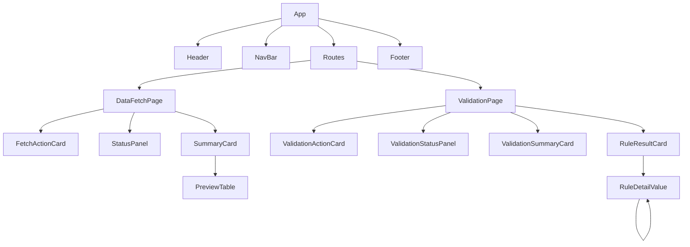

# 06 — Frontend Reference

> **Historical (pre-agentic).** This page describes the codebase at commit `731e6cd`. The fetch/merge services, the JSON mapping and several routes described here have been replaced - see [09 — Agentic architecture](09-agentic-architecture.md) for the current structure.

> Part of the [documentation set](README.md). Source: `frontend/` (Vite + React 18,
> plain JavaScript/JSX, Tailwind CSS 3, react-router-dom 6). 19 source files under
> `src/` plus a logo image; no TypeScript, no state-management library, no tests.

## 1. Bootstrapping

| File | Role |
|---|---|
| `index.html` | Single HTML shell. `<title>Gyansys Migration Tool</title>`, `<div id="root">`, loads `/src/main.jsx` as an ES module. |
| `src/main.jsx` | `ReactDOM.createRoot(...).render(<React.StrictMode><App/></React.StrictMode>)` and imports `index.css`. StrictMode double-invokes effects/renders in dev only. |
| `src/index.css` | `@tailwind base/components/utilities;` plus `body { @apply bg-gray-50 text-gray-900; }`. |
| `vite.config.js` | `@vitejs/plugin-react`, dev server port 5173. |
| `tailwind.config.js` | `content: ["./index.html", "./src/**/*.{js,jsx}"]`, empty `theme.extend`, no plugins. |
| `postcss.config.js` | `tailwindcss` and `autoprefixer`. |

## 2. Application shell and routing (`src/App.jsx`)

```jsx
<BrowserRouter>
  <div className="min-h-screen flex flex-col">
    <Header isConnected connectionChecking />
    <Navbar />
    <main className="flex-1 bg-gray-50">
      <Routes>
        <Route path="/"           element={<Navigate to="/data-fetch" replace />} />
        <Route path="/data-fetch" element={<DataFetchPage />} />
        <Route path="/validation" element={<ValidationPage />} />
      </Routes>
    </main>
    <Footer />
  </div>
</BrowserRouter>
```

| URL | Page |
|---|---|
| `/` | Redirects (replace) to `/data-fetch` |
| `/data-fetch` | `DataFetchPage` |
| `/validation` | `ValidationPage` |
| anything else | Renders an empty `<main>` (no 404 route) |

`isConnected` (`true`) and `connectionChecking` (`false`) are **hard-coded state**
(`useState` without setters); the comment says to wire them to `/api/health` later.
The header therefore always shows a green "Connected" indicator, even if the backend
is down. Because the app uses `BrowserRouter`, deep links such as `/validation`
work in dev, but a production static host must be configured to fall back to
`index.html`.

## 3. Component tree



## 4. API client modules

Both modules define `const API_BASE = import.meta.env.VITE_API_BASE_URL || "http://localhost:8000"`.
Every function uses `fetch`, and on a non-2xx response does:

```js
const body = await res.json().catch(() => ({}));
throw new Error(body.detail || `Request failed (${res.status})`);
```

Consequences: a plain-text 500 becomes `Request failed (500)`; a FastAPI 422 (whose
`detail` is an **array of objects**) becomes the message `[object Object]`.

### `src/api/fetchApi.js`
(The first 55 lines are a commented-out older version.)

| Function | HTTP | Returns |
|---|---|---|
| `fetchS4Files()` | `POST /api/fetch/s4` | `{total_files_fetched, combined_files[], message}` |
| `fetchEccFiles()` | `POST /api/fetch/ecc` | same |
| `downloadCombinedFile(family, sourceType)` | `GET /api/download/{family}/{sourceType}` | *(void)* — reads the response as a `Blob`, creates an object URL and a temporary `<a download="{family}_{sourceType}_combined.xlsx">`, clicks it, removes it and revokes the URL. Whole file is held in browser memory. |
| `fetchPreview(family, sourceType, limit = 20)` | `GET /api/preview/{family}/{sourceType}?limit=` | `{name, columns, rows, total_rows, preview_row_count}` |

### `src/api/validateApi.js`

| Function | HTTP | Returns |
|---|---|---|
| `validateLatest(sheet)` | `GET /api/validate/latest?sheet=` | `ValidationReportResponse` |
| `validateUpload(sheet, eccFile, s4File)` | `POST /api/validate/upload?sheet=` with `FormData{ecc_file, s4_file}` | same |

`handleResponse(res)` is the shared error/JSON helper. (`fetchApi.js` repeats the
same error code inline instead of sharing it.)

## 5. Pages

### `DataFetchPage` (`src/pages/DataFetchPage.jsx`)

Two independent sections — **ECC (DAP) Files** on top, **S4 (Databricks) Files** below —
each with its own status machine. First 57 lines are a commented-out older version.

| State | Type | Meaning |
|---|---|---|
| `eccStatus` / `s4Status` | `"idle" ｜ "loading" ｜ "success" ｜ "error"` | Per-section request state |
| `eccResult` / `s4Result` | `FetchResponse ｜ null` | Last successful response |
| `eccError` / `s4Error` | string | Last error message |

Flow per section:

1. Button click → `handleFetchECC` / `handleFetchS4` sets status `loading`.
2. `await fetchEccFiles()` / `fetchS4Files()`; on success store the result and set
   `success`; on failure store `err.message` (or a default) and set `error`.
3. Render: while status ≠ `success` show `<StatusPanel status error />`; when
   `success` show a two-column grid of `<SummaryCard file={…} />`, one per
   `combined_files` entry (`key={file.name}`).

Details:

* The error string is not cleared when a new fetch starts (harmless — the panel shows
  the *loading* text while loading).
* When a section flips from `success` to `loading`, its `SummaryCard`s unmount, so each
  card's preview/download state resets on every re-fetch.
* The two sections don't block each other; you can fetch ECC and S4 concurrently.

### `ValidationPage` (`src/pages/ValidationPage.jsx`)

Single status machine: `status`, `report`, `error`.

```js
runValidation(fn):  setStatus("loading"); setError("");
                    try { setReport(await fn()); setStatus("success"); }
                    catch (e) { setError(e.message || "…"); setStatus("error"); }
handleRunLatest(sheet)                  → runValidation(() => validateLatest(sheet))
handleRunUpload(sheet, eccFile, s4File) → runValidation(() => validateUpload(...))
```

Render: `<ValidationActionCard/>` always; then either `<ValidationStatusPanel/>`
(when not `success`) or `<ValidationSummaryCard report/>` plus a one-/two-column
grid of `<RuleResultCard rule/>` (`key={rule.rule_id}`).

## 6. Components

### Layout (`components/layout/`)

| Component | Props | Notes |
|---|---|---|
| `Header` | `isConnected`, `connectionChecking` | Black bar with `assets/gyansys-logo.png`, a divider and the title **"Sharepoint Automation Tool"**; right side renders the local `ConnectionStatus` sub-component (pulsing grey "Checking connection…", or a green/red dot with "Connected"/"Disconnected"). |
| `NavBar` | — | Two `NavLink` tabs from the `TABS` array: `/data-fetch` "Data Fetch", `/validation` "Validation". Active tab: `border-black text-black`; inactive: grey with hover. Add a tab by adding to `TABS` **and** a `<Route>` in `App.jsx`. |
| `Footer` | — | Static: "Gyansys Migration Tool", "Version 1.0.0", "© 2026" (hard-coded; the API and `package.json` say 0.1.0). |

### Data fetch (`components/data-fetch/`)

| Component | Props | Behaviour |
|---|---|---|
| `FetchActionCard` | `onFetch`, `isLoading`, `title`, `description` | White card with title/description and a button. Label is `"Fetching…"` while loading, else `` `Fetch ${title.split(" ")[1]}` `` — i.e. **it depends on the title's second word** (`"Fetch ECC Files"` → `Fetch ECC`). Changing the title text changes or breaks the label. Button disabled while loading. The first 27 lines are a commented-out older version. |
| `StatusPanel` | `status`, `error` | `error` → red box `Fetch failed: {error}`; `loading` → "Fetching files and combining them…"; otherwise (idle) → *"No data fetched yet. Click "Fetch from SharePoint" to pull the latest files."* — stale copy: no button is labelled that any more. |
| `SummaryCard` | `file` (a `CombinedFileStat`) | Header `"{family} {source_type}"` and a green "Ready" pill; a 2-cell grid for **Source files** and **Rows** (`toLocaleString()`); the saved server path (truncated, full path in `title` tooltip); and two text buttons — see below. |
| `PreviewTable` | `preview` (`PreviewResponse`) | "No rows to preview." if empty; else "Showing {n} of {total} rows" over a scrollable (`max-h-64`) sticky-header table. Empty/`null`/`undefined` cells render as "—"; everything else via `String(value)`. Columns come from `preview.columns`, so wide files (≈ 250 columns) scroll horizontally. |

**`SummaryCard` internals**

State: `showPreview`, `previewData`, `previewStatus` (`idle|loading|error`),
`previewError`, `downloadStatus` (`idle|loading|error`).

* **Preview file / Hide preview** (`handleTogglePreview`): toggles visibility; the
  first time it opens it calls `fetchPreview(file.family, file.source_type)` (20 rows).
  The result is cached in `previewData`, so hiding/showing doesn't re-request.
* **Download .xlsx** (`handleDownload`): sets `downloadStatus="loading"` (button reads
  "Preparing…" and is disabled), awaits `downloadCombinedFile(family, source_type)`,
  then resets to `idle`. On failure it sets `downloadStatus="error"` — **but nothing
  renders that state and the error message is discarded**, so a failed download is
  silent to the user (the earlier commented-out version showed `downloadError`).

### Validation (`components/validation/`)

| Component | Props | Behaviour |
|---|---|---|
| `ValidationActionCard` | `onRunLatest(sheet)`, `onRunUpload(sheet, ecc, s4)`, `isLoading` | Local state: `sheet` (`"MARC"` default), `mode` (`"latest"` default | `"upload"`), `eccFile`, `s4File`. Two segmented toggles (Sheet: "MARC (Plant Data)" / "MBEW (Valuation Data)"; Source: "Latest files" / "Upload files"). In `latest` mode shows an explanatory sentence; in `upload` mode shows two `<input type="file" accept=".csv,.xlsx,.xls">` controls. The **Run Validation** button is disabled while loading or (in upload mode) until both files are chosen; label becomes "Validating…". The `SHEETS` array is the place to add a new sheet. |
| `ValidationStatusPanel` | `status`, `error` | `error` → red "Validation failed to run: {error}"; `loading` → "Loading files and running validation rules…"; idle → "No validation run yet. Choose a sheet and click "Run Validation"." |
| `ValidationSummaryCard` | `report` | Title `"{sheet} validation report"`, subtitle `Key: A + B`; a badge (`Passed`/`Failed`/`Warning` with colour) reading e.g. `Failed · 1/6 rules passed` (counts only `pass`); a grid with **ECC rows**, **S/4 rows** and a "Sources" cell listing `ECC: {file}` / `S/4: {file}` (truncated, tooltips). |
| `RuleResultCard` | `rule` | Status icon (`✓` green, `✕` red, `!` amber; unknown status falls back to the warning style), rule name and summary. If `details` is non-empty, a **Show details / Hide details** toggle expands a scrollable (`max-h-80`) area rendering each detail via `RuleDetailValue`. |
| `RuleDetailValue` | `value` | Recursive renderer for the heterogeneous `details` payloads: `null/undefined` → "—"; arrays → bullet-less list of boxed items (or "none" if empty); objects → a two-column `<dl>` of `Formatted Key:` / value (keys have underscores→spaces and words capitalised, e.g. `ecc_row_count` → "Ecc Row Count"); primitives → `String(value)`. Comment notes the backend never nests deeper than two levels, but the recursion has no depth limit. |

## 7. Styling conventions

* Tailwind utility classes only; there are no CSS modules or custom components in CSS.
* Palette: black chrome (header/footer), `slate-900` primary buttons, `gray-50` page
  background, white bordered cards (`bg-white border border-gray-200 rounded-lg p-5/6`),
  emerald / red / amber for pass / fail / warning.
* Layout container used everywhere: `max-w-[1600px] mx-auto px-6`.
* The arbitrary-value grid class `grid-cols-[max-content,1fr]` is used in
  `RuleDetailValue`.

## 8. Known frontend gaps (summary)

Full list with severity is in [08-known-issues](08-known-issues.md). In brief:
header connection indicator is hard-coded; download errors are swallowed; stale idle
copy in `StatusPanel`; 422 error bodies render as `[object Object]`; no 404 route; no
cancellation of in-flight requests; lots of commented-out legacy code in several files;
`frontend_zip.zip` is an obsolete snapshot.
